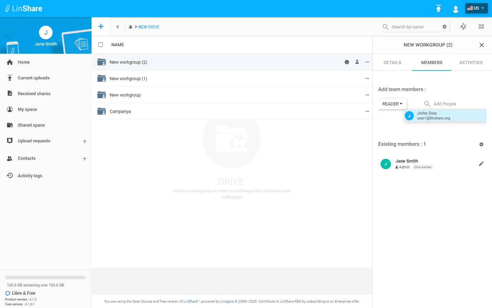
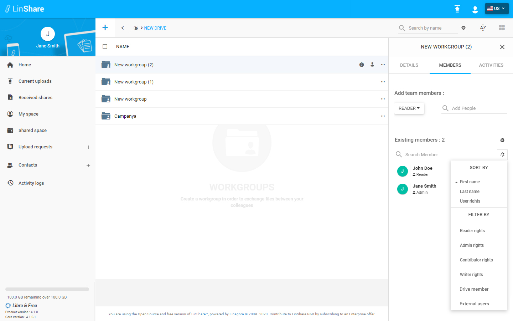

# Summary

* [Related EPIC](#related-epic)
* [Definition](#definition)
* [Screenshots](#screenshots)
* [Misc](#misc)

## Related EPIC

> Links to the epic document in the epic folder, normally README.

* [Name of the epic](./README.md)

## Definition

#### Preconditions
* Given that i am a Linshare user
* Given that the functionality of Drives is enabled in Admin setting
#### Description
* After logged-in successfully, i go to Shared Space
* I can see the list of my drives and workgroups that are not inside any drive.
* I click on a Drive and the the list of workgroups inside
* when i hover a workgroup that i have Admin role, i can see an icon human or click three dot button of that workgroup, i can see the option Add a member is enabled, i click on this option and Member tab of workgroup will be opened. 
*  On Member tab, i can see the list of current workgroup members and there is two types of members:
   *  Internal members are users who also are members of the parent Drive 
   *  External member is an user not a member of parent Drive
*  When i am admin of Drive, i can see the difference of this 2 kinds of members: beside internal member, there will be only one icon Edit, while with external members, there will be 2 icon Delete and Edit 
*  I  select the role and search member on "Add team member" field, the list of suggestion will be displayed.
*  I  choose one user from the list.
#### Postconditions
*  The new member will be added to the workgroup
*  On Existing members section, I can filter user by new criteria : external user or Drive member
*  I can see this action in Workgroup audit. 

[Back to Summary](#summary)

## UI Design

#### Mockups

#### Final design

[Back to Summary](#summary)
## Misc

[Back to Summary](#summary)
