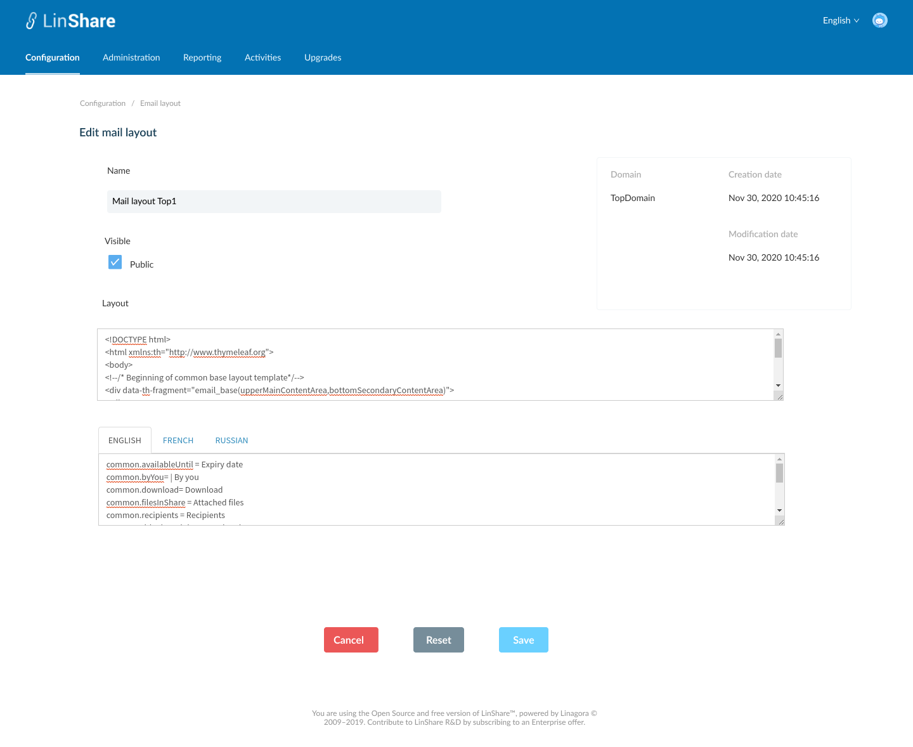
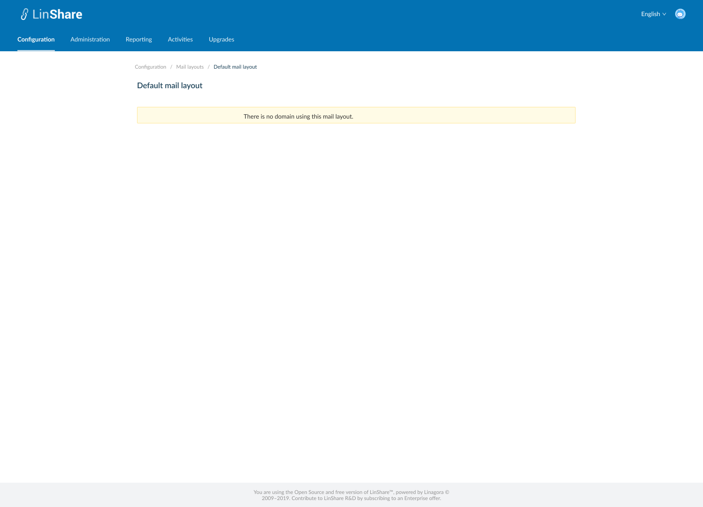

# Summary

* [Related EPIC](#related-epic)
* [Definition](#definition)
* [UI Design](#ui-design)
* [Misc](#misc)

## Related EPIC

* [New admin portal](./README.md)

## Definition

#### Preconditions

- Given that I am super-admin/nested admin in LinShare
- I logged-in to Admin portal successfully
- I select a domain and go to Configuration tab on top navigation bar
- I click on Mails => Mail layouts, the screen Mail layouts list will be opened.
- If I am seeing settings of root domain, I can see the list of Mail layouts that root admin created. They can be used for any lower-level domains if it is public
- If I am seeing settings a nested domain in the domain tree, I can see the list of  Mail layouts that Nested admin created and the Mail layouts from higher level domain.

#### Description

**UC1. Create a mail layout**
- On Mail layouts listing screen, I click on create button
- The screen Create Email layout will be displayed.
- To create an Email layouts, I need to input fields:
    - Name: a text field and mandatory
    - Target domain: is the domain this mail layout will belongs to. Default value is the current selected domain. I can click and select another target domain from the drop-downn list.
    - Model: A drop-down list of mail layouts that target domain has access right. This model will be used to duplicate for new layout
    - Visible: This checkbox is to allow  subdomains to use this layout or not.
- After input above fields, I click button Create, if there is no blank field, the new mail layout is created successfully with a toast message
- I am redirected to the Screen Mail layouts listing and the new created mail layout is displayed in the table.

**UC2. Edit mail layout**.
- If I am super-admin, I can edit all mail layouts
- If I am nested admin, I can only edit the mail layout created by me and my lower-level domain.
- There are 2 ways to access a mail layouts screen:
    - In the mail layouts listing screen, I click on three dot-button of a mail layout and select option Edit from the drop-down list
    - Or I can click on the mail layout  row in the mail configuration listing table.
- By default, the mail layout detail screen will be in View mode
- If I have permission to Edit, there will be button Edit, I click on this button, the Edit mode will be enabled
- I can edit all fields including:
    - Name
    - Visible: checkbox
    - Mail layout: a string value that automatically filled by the same field in the model that I selected in Create layout screen.
    - Message translation: There are 3 tabs for 3 languages: English, Русский, Français. Each tab displays message translation list in one language. This is a string value that automatically filled by the same field in the model that I selected in Create layout screen.     

- The non-editable fields include:
    - Domain
    - Creation date
    -Modification date
- After editing I click button Save, The system will validate if field "Name" is blank, it will be highlighted in red and a message:"[field name] cannot be blank"
- If there is no error, the updates will be saved and there will be a successful toast message.
- If I click button Reset, all the updates will be reset to the before values.

**UC3. View email layout**
- If I am nested admin, On email layout listing screen,  when I click on three-dot button of a email layout from higher level domain,
  I can see the option "View"
- When I click on this button, the screen email layiut detail will be displayed in mode "view"
- I can not update any field, and there is no button Delete, Save, Reset as Edit screen

**UC4. Delete an Email layout**
- If I am nested admin I can only delete Email layout in my domain and my nested domain. I cannot delete Email layout from higher-domain
- If I am super-admin, I can delete every  Email layout
- There is no Delete button for Default Email layout
- There are 2 ways to delete a Email layout:
    - In the  Email layout listing screen, I click on three dot-button of an Email layout and select option Delete from the drop-down list
    - Or I can click an Email layout row on the listing table to go to Email configuration detail screen. On this screen I can see the button Delete.
- When I click on button Delete:
    - If the Email layout is not used in any mail configuration, there will be an confirmation popup: "You are about to delete this Email layout, this procedure is irreversible. Do you want to proceed?" and Yes/No button
        - I choose Yes to confirm, the Email layout will be deleted.
        - System will prompt a deletion confirmation toast.
    - If the Email layout is used in any mail configuration, the system will display message: "This Email layout is used with at least one mail configuration. You cannot delete."

**UC5. Delete multiple Email layouts**

- On Email configuration listing screen, I can select multiple Email layouts on the list by tick the checkbox of each item
- There will be a top bar that indicates number of selected Email layouts, an isolation icon, an Undo icon and a Delete icon.
- When I click on Isolation icon, the screen only shows selected items
- When I click on Undo icon, all the selected items are unselected
- If I do not have permission to delete any of selected Email layout, the button Delete will be disabled.
- When I click on button Delete:
    - If any of selected Email layouts is not used in any mail configuration, there will be a confirmation popup: "You are about to delete [number of selected items] Email layouts, this procedure is irreversible. Do you want to proceed?" and Yes/No button
        - I choose Yes to confirm, the selected Email layouts will be deleted.
        - System will prompt a deletion confirmation toast.
    - If any of selected Email layouts is used in any mail configuration, the system will display message: " One of selected Email layout is used in at least one mail configuration. You cannot delete."
    
**UC6 Duplicate an email layout**
- On the Welcome email layout listing screen, i click on thee-dot button of a Welcome messages and select option Duplicate from the drop-down list
- The screen Create layout will be opened (UC1)
- Except the field Name is blank, other fields will have the same value as the email layout that I selected to duplicate
- I input the field Name, and can edit other fields
- When I click button Save, the system will validate as UC 1, create a new Email layout.
  
**UC7. View associated email configurations**

- On Email configuration listing screen, I click on three-dot button on Action column.
- I select option "View associated configurations"
- A new screen will be opened
- I can see the list of email configurations which are using this Email layout.
- There will be a label next to each email configuration's name that indicating domain 's name of email configuration
- When I click one email configuration on the list, I am navigated to detail screen of that email configuration.
- If the Email layout is not used with any email configuration, there will be a text message: " There is no email configuration using this Email layout. "
- If I am the nested admin, I can only view associates email configuration which are under my administration permission.

#### Postconditions

[Back to Summary](#summary)

## UI Design

#### Mockups

#### Final design

[Back to Summary](#summary)
## Misc

[Back to Summary](#summary)
