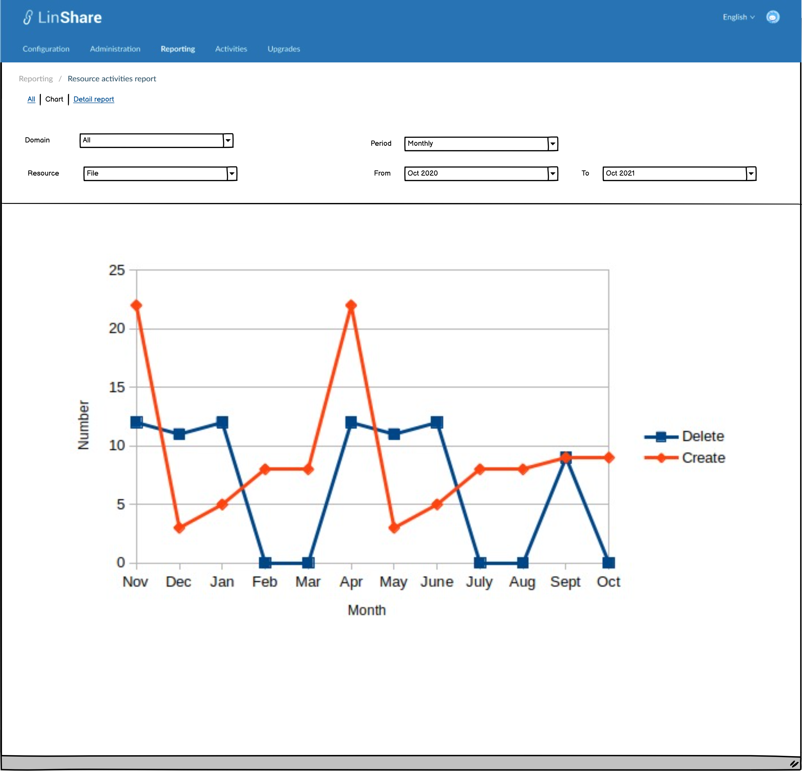
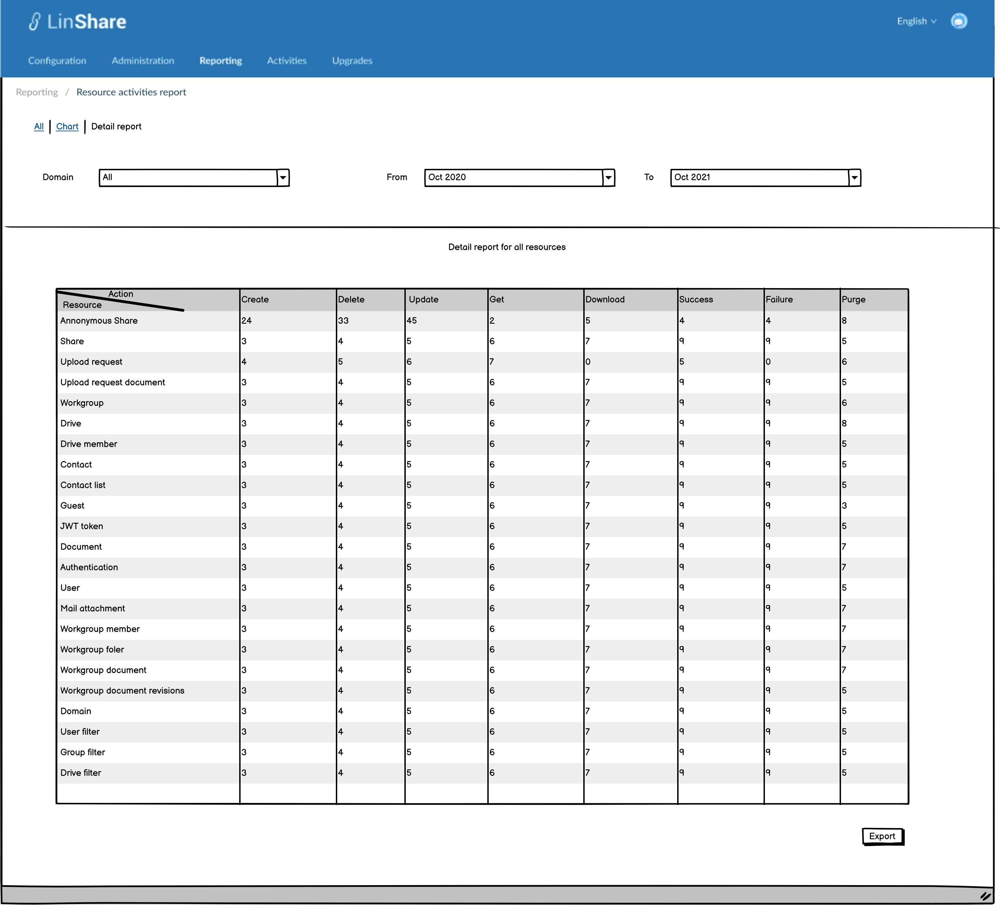

# Summary

* [Related EPIC](#related-epic)
* [Definition](#definition)
* [UI Design](#ui-design)
* [Misc](#misc)

## Related EPIC

* [New admin portal](./README.md)

## Definition

#### Preconditions

- Given that am super admin or nested admin of LinShare
- After log-in successfully, I go to  Tab Reporting 
- I click on Resource activities report, a new screen will be opened.

#### Description

- I can see 3 tabs on the screen: Home, Charts, Detailed Reports

##### UC1. First tab: Home

- On the first tab, I can see the filters and the charts below:
   - Filters include:
      - Domain: A combo-box. 
         - If I am root domain, I can see the list of all domains . 
         - If I am nested admin, I can see list of domains in which I have administration right. 
         - Default option is "All".
      - Time: A combo-box
         - When click on this field, I can see the list of options: This week, this month, this year and custom range
         - If I select custom range, the field "From" and "To" will be displayed, which allow me to select the date range
         - Default option is this month. 
- When I select a domain and time and click Enter, the charts below will reflect data of the selected domain in selected time
   - Charts include:
     - Uploaded files  : This is the statistics of uploaded files. They are grouped into 3 categories:
       - Media files: Include images and videos. 
       - Documents: Includes files in document format. 
       - Others: The remaining files which do not belong to 2 above groups. 
     - Each category will display number of uploaded files and total file size
     - There is a summary statistics for 3 categories with total number of uploaded files and total file size

##### UC2. Second tab: Charts

- On second tab, I can see filter fields and a line chart below
- Filter fields include:
   - Domain: A combo-box.
     - If I am root domain, I can see the list of all domains .
     - If I am nested admin, I can see list of domains in which I have administration right.
     - Default option is "All".
   - Period: A combo-box
       - When click on this field, I can see the list of options: Monthly, weekly, daily. Default value is monthly, time frame is 1 year
       - The field "From" and "To" will be displayed corresponding: If I selected monthly period, I can only select From[month/year] to [month/year]. If I select weekly, I can only select From [week/year] to [week/year]
   - Resources: 
      - If I am super admin, I can select all available resources: Anonymous Share, Share, Upload request,  Upload request document, Workgroup, Drive, Drive member, Contact,  Contact list, Guest, JWT token, Document, Authentication, User, Mail attachment, Workgroup member, Workgroup folder, Workgroup document, Workgroup document revisions, Domain
      User filter, Group filter, Drive filter
      - If I am nested admin , I can select all other resources except for:  Domain User filter, Group filter, Drive filter, Domains, Remote server, Providers,
      - Default value is File
- After I select the filter fields and click Enter, the Line chart will display number of deletion and creation of the selected resource in select period of time

##### UC3. Third tab: Detailed Reports

- On third tab, I can see filters and a report below
- Filter fields include:
    - Domain: A combo-box.
        - If I am root domain, I can see the list of all domains .
        - If I am nested admin, I can see list of domains in which I have administration right.
        - Default option is "All".
    - Period: Includes 2 date pickers "From" and "To", which allow me to select the date range
- After select domain and time frame, I click Enter and the Report will be generated with detail statistics about activities of every resource that I am allow to access

#### Post-conditions

[Back to Summary](#summary)

## UI Design

#### Mockups

#### Final design

[Back to Summary](#summary)
## Misc

[Back to Summary](#summary)

