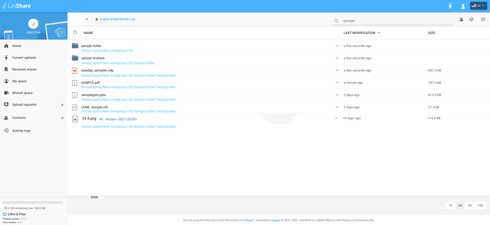

# Summary

* [Related EPIC](#related-epic)
* [Definition](#definition)
* [Screenshots](#screenshots)
* [Misc](#misc)

## Related EPIC

> Links to the epic document in the epic folder, normally README.

* [Workgroups](./README.md)

## Definition

#### Preconditions

- Given that i am a LinShare user.
- Given that "Workgroup" functionality is enabled in Admin.

#### Description

**UC1. Search files or folders inside a workgroup**

- After logged-in successfully to LinShare, i go to Shared Space and see the list of workgroups.
- I click on a workgroup and see the list of files/folders inside.
- I can see field "Search by name" on top right of screen and click on icon setting next to this field
- The popup Advanced Search settings will be displayed (Screen1) and i can see the list of search criteria including:
    - Type: includes three checkboxes Files/Folders/Revisions and be ticked by default.
     and a drop-down list with the options: Any types/ Images/Documents/PDFs/Spreadsheets/Presentations/Audio/Video/Other. 
    - Size: i can custom the range of size with a tooltip : only applied for file and revision
    - Creation date: I can custom creation date. 
    - Modification date: I can custom modification date range
    - File/folder's Author: When i input some character of name or email, system will display a suggestion list that allow me to pick. I can input multiple owners in this field.
- After choosing search critetia, i input characters on the field " Search by name"
- The system will search files and folders name  inside that workgroup and display search result instantly in the list below (Screen 2)
- The result will include not only files/folders at first level of the workgroup but also files/folder at child levels of folders inside the workgroup.

**UC2. Search files or folders inside a folder**

- After logg-in successfully to LinShare, i go to Shared Space 
- I click on a workgroup and go to a folder inside that workgroup
- On the top right of screen i see the field "Search by name" and click on icon setting next to this field.
- A popup Advanced Search Settings will be displayed (Screen 3) and i can see the list of search criteria including:
    - Type: includes three checkboxes Files/Folders/Revisions and be ticked by default.
     and a drop-down list with the options: Any types/ Images/Documents/PDFs/Spreadsheets/Presentations
    - Size: i can custom the range of size with a tooltip : only applied for file and revision
    - Creation date: I can custom creation date range
    - Modification date: I can custom modification date range
    - File/folder's Author: When i input some character of name or email, system will display a suggestion list that allow me to pick. I can input multiple owners in this field.
- After choosing search critetia, i input characters on the field " Search by name" and click Enter 
- The system will search file/folders inside current folder, including child folders of current folder and display result list.

#### Postconditions

- The result will include not only files/folders at first level of the workgroup but also files/folder at child levels of folders inside the workgroup. 
- In result list, with each item, i can see a full path below each item with an file type/folder icon. 
- When i click on three-dots button of a file in the list, i can see the options: Details, Go to destination, Preview, Download. If the workgoup's versioning is enabled and the file is not a version file, i can see the option Manage version, If the file is a version file i cannot see the option Manage version. 
- When i click on go to destination, i am navigated to file location
- With revision in the result list: i can see the original file name and the version ID = Creation date.
- When i hover the Version ID, i can see the detailed hour, minute and second of creation date. 
- When i click on one item, it will go directly to the location of that item.
- The Search criteria will be kept until user change the setting.

[Back to Summary](#summary)

## UI Design

#### Mockups

##### Screen 1

##### Screen 2

##### Screen 3

#### Final design

[Back to Summary](#summary)
## Misc

[Back to Summary](#summary)
